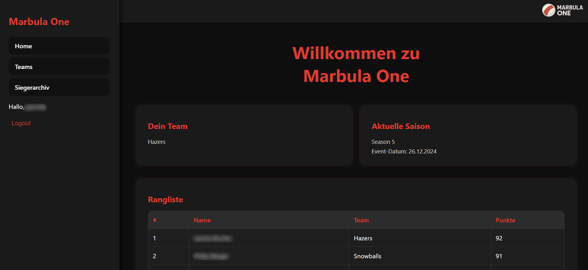
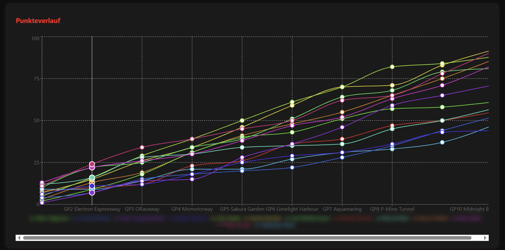

# Marbula One App

Dies ist eine MERN-Stack Webanwendung, die für ein jährliches
Freundes-Event entwickelt wurde. Ziel ist es, Teams zu verwalten, Rennen
zu erfassen, Punkte zu vergeben und Gewinner übersichtlich darzustellen.

## Vorschau



## Features

-   Benutzerregistrierung und Login (mit Username, nicht E-Mail)
-   Teamwahl durch Benutzer (ein Team pro Person)
-   Saison-Management inklusive Teilnehmerauswahl
-   Rennen verwalten (Teilnehmer, Punktevergabe)
-   Ranglisten und Punktetabellen
-   Graphische Punkteverläufe wie bei Mario Party
-   Event-Gewinner archivieren (Adminfunktion)
-   Admin-Oberfläche mit strukturierter Sidebar
-   Mobilefreundliches, modernes Design ohne Tailwind im Hauptfrontend

## Projektstruktur

```
marbula-one-app/
├── backend/                  # Node.js + Express + MongoDB API
│   ├── models/              # Mongoose-Modelle (User, Team, Race, Winner, usw.)
│   ├── controllers/         # API-Logik
│   ├── routes/              # REST-Endpunkte
│   ├── middleware/          # Authentifizierung usw.
│   └── server.js            # Einstiegspunkt für das Backend
│
├── frontend/                 # React-Client
│   └── src/
│       ├── pages/           # Hauptseiten (Home, Teams, Win, Admin-Bereich)
│       ├── components/      # Navbar, ProtectedRoute usw.
│       ├── layouts/         # DashboardLayout usw.
│       └── context/         # Globale Zustände (AuthContext)
│
└── README.md                # Diese Datei
```

## Technologien

### Backend

-   Node.js
-   Express.js
-   MongoDB mit Mongoose
-   JWT-Authentifizierung
-   dotenv für Konfiguration

### Frontend

-   React
-   Axios (API-Kommunikation)
-   CSS (ohne Tailwind im Hauptbereich)
-   Recharts (für Punktediagramme)
-   Zustand über React Context

## Lokales Setup

### Voraussetzungen

-   Node.js und npm
-   MongoDB Atlas Account (oder lokale Instanz)

### Schritte

1.  Projekt klonen git clone
    https://github.com/dein-benutzername/marbula-one-app.git cd
    marbula-one-app

2.  Backend installieren cd backend npm install

3.  Backend .env Datei erstellen

   ```bash
MONGO_URI=`<Deine MongoDB-Verbindungszeichenfolge>`{=html}
JWT_SECRET=`<Geheimer Schlüssel>`{=html}
PORT=5000
```

5.  Backend starten npm run dev

6.  Frontend installieren cd ../frontend npm install

7.  Frontend starten npm start

8.  Aufrufen unter: Frontend: http://localhost:3000 Backend:
    http://localhost:5000

## Benutzerrollen

  | Rolle       | Rechte                 |
| ------------- | --------------------------- |
| **Admin**  | Teams, Rennen, Saisons verwalten, Punkte erfassen, Gewinner eintragen |
| **Benutzer**   | Team wählen, Resultate einsehen, Statistiken verfolgen |

## Authentifizierung

-   JWT-Token werden bei Login im localStorage gespeichert.
-   ProtectedRoute.js schützt Seiten vor unbefugtem Zugriff.

## Fragen / Screenshots



